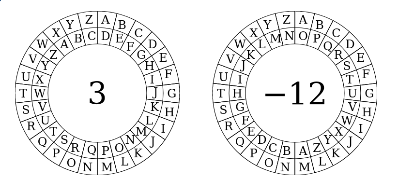

# Java---Text-Manipulation
In this exercise all sorts of manipulations on text are done. All of these manipulations are expected to be done within the class TextManipulation.

The following things are expected to be implemented:

- A given string should be converted into a string with only upper case letters with the method convertToUpperCase(String string)
- A given string should be converted into a string with only lower case letters with the method convertToLowerCase(String string)
- You have to write a method that checks if two strings are an anagram of one another, this method is called isAnagram(String a, String b)
- Write a method that reverses the string in reverseString(String a)
- Apply Caesar's cipher to a given input with a given shift in the method caesarCipherCode(String input, int cyperShift). A Caesar cipher is obtained by shifting each character in a string a fixed number of places in the alphabet and using these shifted characters to create an encoded message. Note that the following conditions do apply:
  - Only part of the alphabet needs to be used: 0-9 and a-z in this order
  - All other characters should not be shifted and just returned as they are.
  - The cipher should be blind to upper case characters
  - For a clear example, look at the figure below
- Write a decoder for the Ceasar's cipher for a coded message and the used shift in the method caesarCipherDecode(String input, int cyperShift)
  
No main() method is needed for this exercise!

